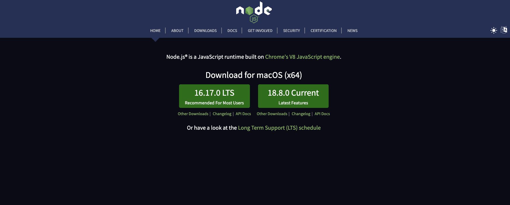
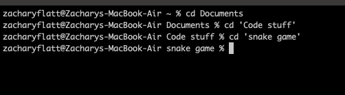
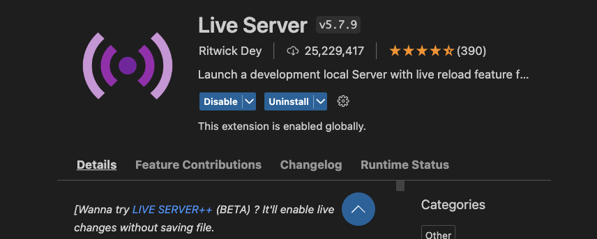

# Snake-Game - **A simple snake game written in Javscript**

     

**__How to run the game__**
1. You need to have node js installed -- https://nodejs.org/en/

2. Download all files above
3. Open a new terminal and CD into the directory where you saved the code

4. Install Live Server in Visual Studio Code
5. 
6. Right click the html file and open with live server
